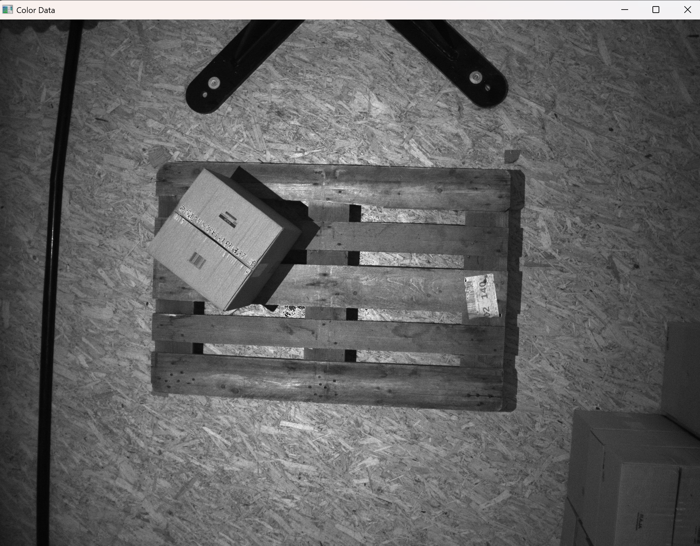

# 3D Pose Estimation of a Box Using Depth Data

## Overview

Determine the 3D pose (position and orientation) of a box placed on a pallet using data captured by a top-down camera. The approach uses geometric feature extraction from point cloud data derived from depth images.

## Dataset

The input data consists of `.npy` files containing:
* **Extrinsic Matrix:** Defines the camera's position and orientation in the world.
* **Intrinsic Matrix:** Describes the camera's internal parameters (focal length, principal point).
* **Depth Data:** Per-pixel distance information from the camera.
* **Color Image Data:** 2D image of the scene.

The experimental setup involves a single box placed on top of a pallet, viewed by a camera positioned directly above.

**Color Image:**
*(Illustrates the scene setup)*

**Depth Data Visualization:**
*(Shows the raw depth information)*

## Approach

The approach involves processing the depth data to isolate the box's top surface and then determining its orientation and position.

1.  **Data Loading & Initial Analysis:** The `.npy` files are loaded to access the camera parameters and image data.
2.  **Point Cloud Generation:** Depth data is converted into a 3D point cloud using the camera's intrinsic parameters.
3.  **Depth Filtering:** The point cloud is filtered based on depth values. A threshold is applied to remove points corresponding to the pallet and the ground floor, isolating points potentially belonging to the box.
4.  **Statistical Outlier Removal:** Open3D's statistical outlier removal function is used on the filtered point cloud. This step eliminates sparse outliers based on the local point density (defined by `neighbors` and `std_ratio` parameters).
5.  **Plane Segmentation (RANSAC):** The RANSAC (Random Sample Consensus) algorithm is applied to the cleaned point cloud to robustly detect the dominant planar surface, assumed to be the top face of the box. This runs for a specified number of iterations (e.g., 1000) to find the best-fit plane model and the corresponding inlier points.
6.  **Plane Point Cloud Refinement:** Outlier removal is performed again, specifically on the point cloud belonging to the segmented plane, to further refine the points representing the box's top surface.
7.  **Pose Estimation via PCA:**
    * **Principal Component Analysis (PCA):** PCA is applied to the refined plane's point cloud to determine its principal axes. These axes correspond to the directions of maximum variance, effectively giving the orientation of the plane in 3D space (X and Y axes).
    * **Axis Calculation:** The first two principal components are taken as the X and Y axes of the object's coordinate frame. The Z-axis (normal to the plane) is calculated using the cross product of the X and Y axes.
    * **Normalization:** All three axes (X, Y, Z) are normalized to form unit vectors.
8.  **Transformation Matrix Construction:**
    * **Rotation Matrix (R):** The normalized X, Y, and Z axis vectors are stacked column-wise to form the 3x3 rotation matrix `R`, representing the object's orientation relative to the camera.
    * **Translation Vector (T):** The centroid (average position) of the refined plane's point cloud is calculated. This serves as the translation vector `T`, representing the object's position relative to the camera.
    * **Transformation Matrix (`t_cam_obj`):** The 4x4 homogeneous transformation matrix is constructed by combining `R` and `T`. This matrix transforms points from the object's local coordinate frame to the camera's coordinate frame, thus defining the object's pose in the camera's view.

## Assumptions

* The primary assumption is that the **top surface of the box is the most dominant planar surface above the pallet** within the filtered depth range.
* The box's top surface is reasonably parallel to the camera's XY plane (due to the top-down view), although the algorithm can handle some tilt.
* The depth data quality is sufficient to distinguish the box from the pallet.

## Results and Visualization

The final output demonstrates the estimated 3D pose of the box overlaid on the point cloud data.

**Overview Visualization:**
*(Shows the overall result with context)*

**Key Elements in Result Visualization:**
* **Red Box:** An axis-aligned bounding box encompassing point cloud points identified as belonging to the box after plane segmentation.
* **Green Point Cloud:** The points identified as the top planar surface of the box by the RANSAC algorithm.
* **Object Axis Marker (within Red BBox):** A 3D coordinate frame indicating the estimated pose (position and orientation) of the box. The Z-axis (typically blue) points upwards, away from the pallet.
* **Camera Axis Marker (Top):** A 3D coordinate frame representing the camera's pose. The Z-axis (typically blue) points downwards, towards the scene.

**Zoomed-in Views:**
*(Provide closer looks at the estimated pose)*

These visualizations confirm the successful detection and pose estimation of the box based on its geometric features extracted from the depth data. The estimated coordinate frame aligns well with the perceived orientation of the box's top surface.
