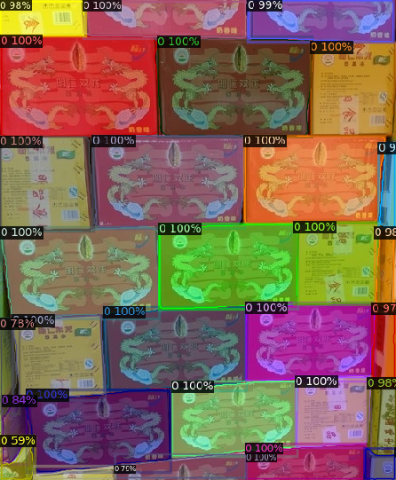
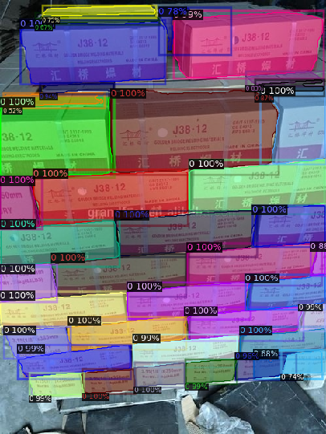
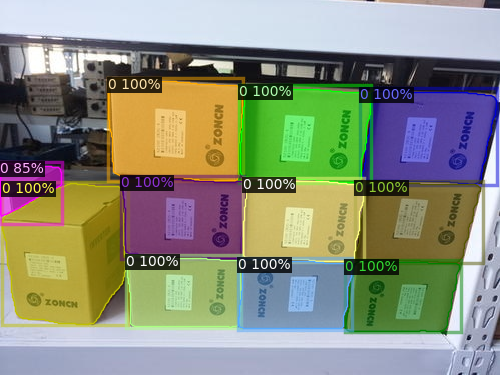
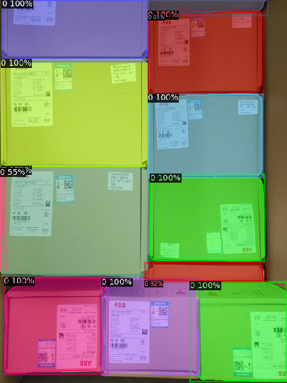
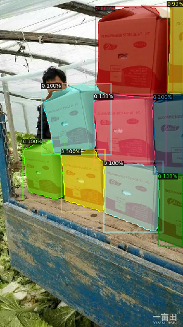
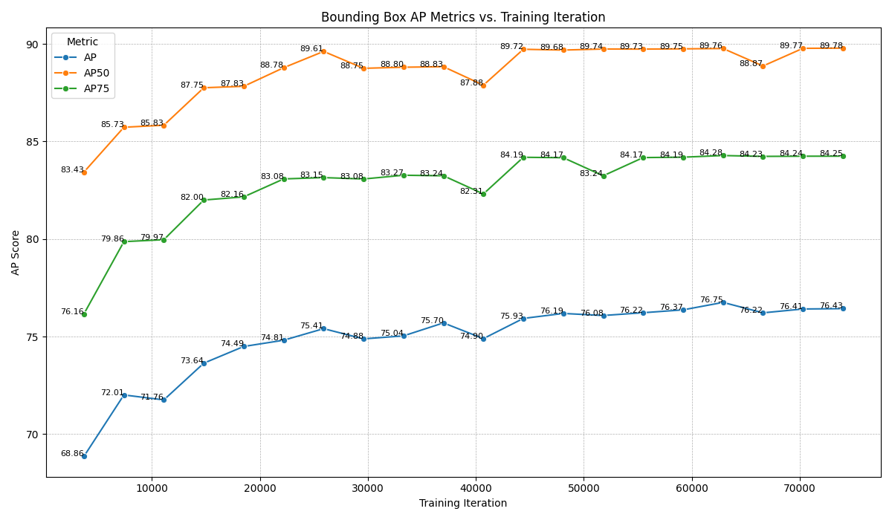
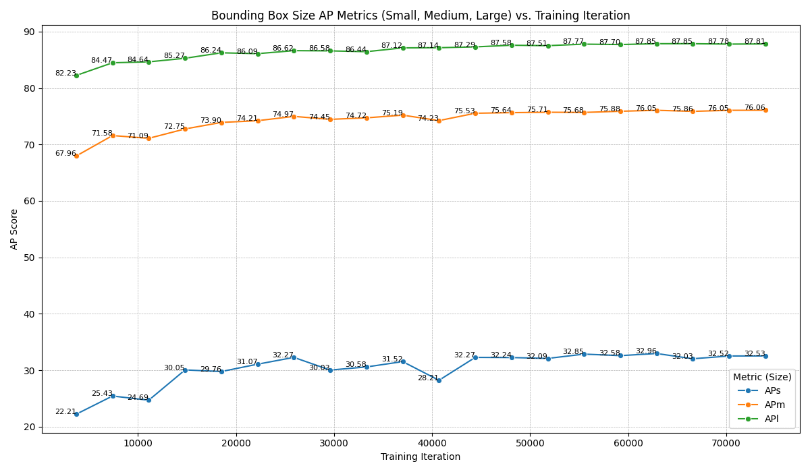
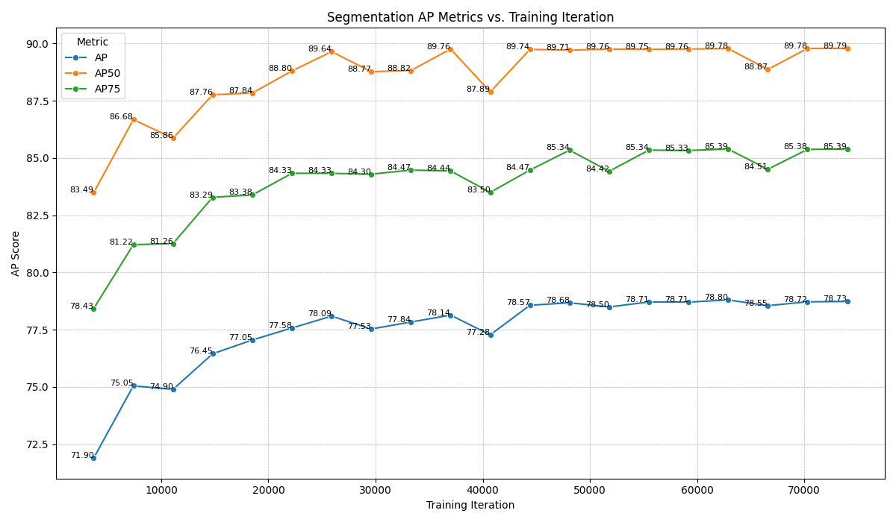

# Carton Detection and Segmentation using Detectron2

This repository contains code and resources for training and evaluating a Mask R-CNN model for detecting and segmenting cartons in images, using the Detectron2 framework.

**Key Resources:**

*   **Trained Models & Logs:** [Google Drive Folder](https://drive.google.com/drive/folders/1yVbEHCQSPl9GIOZb95c_BbYejA8DMCet?usp=sharing)
*   **Training Code:** `train.py` (available in this repository)
*   **Dataset Sources:**
    *   Link provided in task: [SCD Dataset Repository](https://github.com/yancie-yjr/scd.github.io)
    *   OSCD datatset: [Google Drive Link](https://drive.google.com/file/d/1YeZ4mg_qZ4dBvKKfgGF8RQcyOMNoMp37/view)

---

## Table of Contents

*   [Overview](#overview)
*   [Performance Highlights](#performance-highlights)
    *   [Sample Predictions](#sample-predictions)
    *   [Quantitative Results (Graphs)](#quantitative-results-graphs)
*   [Dataset](#dataset)
*   [Model Architecture](#model-architecture)
*   [Training Methodology](#training-methodology)
    *   [Framework](#framework)
    *   [Loss Functions](#loss-functions)
    *   [Learning Rate Schedule](#learning-rate-schedule)
    *   [Augmentations](#augmentations)
    *   [Training Duration](#training-duration)
*   [Evaluation](#evaluation)
    *   [Metrics](#metrics)
    *   [Results Interpretation](#results-interpretation)
    *   [Summary](#summary)
*   [Setup and Usage](#setup-and-usage)
    *   [Prerequisites](#prerequisites)
    *   [Dataset Preparation](#dataset-preparation)
    *   [Training](#training)
    *   [Visualization](#visualization)
*   [Potential Improvements](#potential-improvements)

---

## Overview

 The task is to accurately detect bounding boxes and generate segmentation masks for cartons within images. A Mask R-CNN model with a ResNet-50 backbone, implemented in Detectron2, was trained on the SCD dataset. This README details the training setup, evaluation results, and instructions for reproducing the work.

---

## Performance Highlights

### Sample Predictions

Here are a few sample predictions from the final trained model (`model_final.pth`) applied to the validation set.

| Sample 1                 | Sample 2                 | Sample 3                 | Sample 4                 | Sample 5                 |
| :----------------------: | :----------------------: | :----------------------: | :----------------------: | :----------------------: |
|  |  |  |  |  |

The visualizations can be generated using the provided `visualize.py` script.

### Quantitative Results (Graphs)

The following plots illustrate the model's performance on the validation set throughout the training process, tracked at various checkpoints.

1.  **Bounding Box AP Metrics vs. Training Iteration:** Shows the trend of overall AP, AP50 (IoU threshold 0.50), and AP75 (IoU threshold 0.75) for bounding box detection.
    

2.  **Bounding Box Size AP Metrics vs. Training Iteration:** Tracks performance specifically for small (APs), medium (APm), and large (APl) objects, providing insights into scale-specific challenges.
    

3.  **Segmentation AP Metrics vs. Training Iteration:** Shows the trend of AP, AP50, and AP75 for instance segmentation mask quality.
    


---

## Dataset

The model was trained on the **SCD (Shopping Cart Dataset)**.

*   **Source:** [https://github.com/yancie-yjr/scd.github.io](https://github.com/yancie-yjr/scd.github.io)
*   **OSCD dataset:** [Google Drive](https://drive.google.com/file/d/1YeZ4mg_qZ4dBvKKfgGF8RQcyOMNoMp37/view)
*   **Size:** Contains approximately 7400 images for training.

**Important Note:** The original JSON annotation files in this dataset contained incorrect image height and width values for some entries. A utility script, `utils/change_image_dim_in_jsons.py`, is provided in this repository to correct these dimensions based on the actual image files. **This script must be run on the annotation files before starting the training process.**

---

## Model Architecture

*   **Architecture:** Mask R-CNN
*   **Backbone:** ResNet-50 with Feature Pyramid Network (FPN)
*   **Implementation:** Detectron2

**Rationale:**
Mask R-CNN remains a strong and widely adopted baseline for instance segmentation. Given the dataset size (~7400 images), it offers a good balance between performance and model complexity compared to potentially data-hungrier Transformer architectures.
The ResNet-50 backbone, combined with FPN, provides a solid foundation for extracting multi-scale features, which is crucial for detecting objects of varying sizes. While ResNet-101 offers higher capacity, ResNet-50 is often sufficient and trains faster, making it a suitable choice here. Detectron2 provides a robust and efficient implementation.

---

## Training Methodology

### Framework

*   Detectron2 (PyTorch)

### Loss Functions

Detectron2's Mask R-CNN implementation utilizes a standard multi-task loss:

1.  **RPN Loss:** Combines classification loss (object vs. background) and bounding box regression loss for anchor proposals.
2.  **ROI Head Loss:**
    *   **Classification Loss:** Cross-entropy loss for the predicted class labels (in this case, 'Carton' vs. background).
    *   **Bounding Box Regression Loss:** Smooth L1 loss comparing predicted box refinements to ground truth boxes.
    *   **Mask Loss:** Per-pixel binary cross-entropy loss applied to the mask predictions within the detected RoIs.

The final loss is a weighted sum of these components, optimized end-to-end.

### Learning Rate Schedule

*   **Initial Learning Rate:** `0.0005`
*   **Scheduler:** `WarmupCosineLR`

**Rationale:**
The `WarmupCosineLR` schedule starts with a very low learning rate, gradually increases it to the target value (0.0005) over a "warmup" period, and then smoothly decays the learning rate following a cosine curve towards zero. This strategy is effective because:
    *   **Warmup:** Prevents large, potentially destabilizing updates early in training when the model weights are randomly initialized (or loaded from pretraining).
    *   **Cosine Decay:** Allows for larger updates initially when the model is learning rapidly, and smaller, more refined updates later in training as the model converges.

### Augmentations

*   **Baseline:** Horizontal Flip (applied randomly during training).

**Note:** Only basic flipping was used for this training run. Further performance improvements might be achievable by incorporating more sophisticated augmentations like random cropping, brightness/contrast/saturation adjustments, or geometric transformations, particularly those targeting scale variance.

### Training Duration

*   **Total Iterations:** ~74,000
*   **Epochs:** 20 (approximate, based on dataset size)
*   **Batch Size:** 2 images per iteration
*   **Hardware:** (Specify GPU used, GTX 1660 TI laptop GPU with 6GB VRAM)
*   **Training Logs:** Detailed logs are available in file `training-log.txt` the shared [Google Drive Folder](https://drive.google.com/drive/folders/1yVbEHCQSPl9GIOZb95c_BbYejA8DMCet?usp=sharing).

*(Calculation: ~7400 training images / 2 images/batch * 20 epochs = 74,000 iterations)*

---

## Evaluation

### Metrics

Standard COCO evaluation metrics were used to assess performance on the validation set:

*   **AP:** Average Precision across multiple IoU (Intersection over Union) thresholds (0.50:0.05:0.95). 
*   **AP50:** AP at a single IoU threshold of 0.50 (PASCAL VOC metric). 
*   **AP75:** AP at a single IoU threshold of 0.75. 
*   **APs, APm, APl:** AP for small, medium, and large objects, respectively.

These metrics were calculated for both bounding box detection (`bbox`) and instance segmentation (`segm`).

### Results Interpretation

*(Refer to the plots in the [Performance Highlights](#quantitative-results-graphs) section)*

*   **Good Learning:** The model demonstrates clear learning, with all metrics significantly improving from the initial iterations.
*   **Plateau Reached:** Performance, particularly for overall AP and AP75, tends to plateau around **50,000 - 60,000 iterations**. Subsequent gains are marginal or show slight fluctuations.
*   **No Obvious Overfitting:** Validation metrics stabilize rather than consistently decreasing after peaking. This indicates reasonable generalization to the unseen validation data throughout training.
*   **Segmentation vs. Bounding Box:** Segmentation AP slightly outperforms bounding box AP across most metrics (AP, AP50, AP75). This suggests the model generates accurate masks that capture object shape well.
*   **Main Weakness: Small Objects:** The APs metric ( blue in Bounding Box Size AP Metrics vs. Training Iteration) remains significantly lower than APm and APl. The model struggles to reliably detect and accurately segment small cartons compared to medium and large ones.

### Summary

The training process was successful, achieving a strong performance level on the validation set without significant overfitting. An optimal stopping point appears to be between 55,000 and 65,000 iterations. The primary limitation identified is the model's difficulty with small objects.

---

## Setup and Usage

### Prerequisites

*   Python (3.7+)
*   PyTorch (>=1.8)
*   Detectron2: Follow the official installation guide: [Detectron2 Installation](https://detectron2.readthedocs.io/en/latest/tutorials/install.html)
*   OpenCV (`pip install opencv-python`)
*   Other standard libraries (`numpy`, etc.)

### Dataset Preparation

1.  **Download:** Obtain the SCD dataset from one of the links provided above.
2.  **Organize:** Structure the dataset into `images` and `annotations` folders as expected by COCO format.
3.  **Correct Annotations:** **Crucially, run the provided script to fix image dimensions in the JSON files:**
    ```bash
    python utils/change_image_dim_in_jsons.py --json_dir path/to/your/annotations
    ```
    Replace `path/to/your/annotations` with the directory containing your `instances_train2017.json` and `instances_val2017.json`files.

### Training

1.  **Configure Paths:** Open the `train.py` script and modify the paths for:
    *   Training/Validation image directories
    *   Corrected training/Validation annotation JSON files
    *   Output directory (`cfg.OUTPUT_DIR`) where models and logs will be saved.
2.  **Run Training:**
    ```
    python train.py
    ```

### Visualization

1.  **Configure Paths:** Open the `visualize.py` script and set the paths to:
    *   The images you want to visualize.
    *   The trained model weights (`.pth` file).
    *   The corresponding configuration file used during training (or recreate the config in the script).
2.  **Install OpenCV:** Ensure you have `opencv-python` installed (`pip install opencv-python`).
3.  **Run Visualization:**
    ```
    python visualize.py
    ```

---

## Potential Improvements

Based on the evaluation, potential areas for future work include:

1.  **Addressing Small Objects:**
    *   **Data Augmentation:** Implement augmentations specifically targeting scale variance (e.g., resizing, multi-scale training).
    *   **Anchor Generation:** Tune anchor box sizes and aspect ratios in the RPN if defaults are suboptimal for small cartons.
    *   **Architecture:** Experiment with different FPN configurations or backbone features known to better handle small objects.
2.  **Hyperparameter Tuning:** Systematically tune learning rate, weight decay, optimizer, or scheduler parameters.
---
